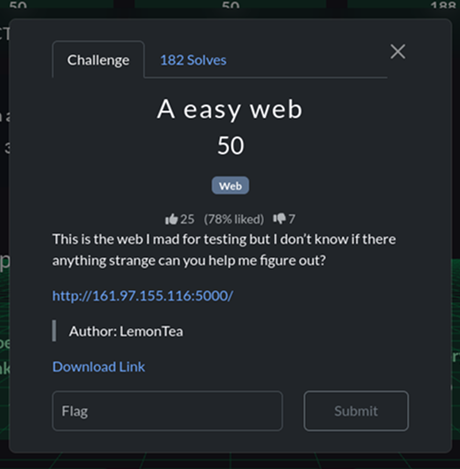

# WhiteDukesDZ - QnQSec CTF 2025 Writeup: Easy Web Challenge




We were also provided with the `back` file (the Dockerfile used) as part of this challenge.

---

## Application Analysis


After reviewing `back`, we identified the exact flag name and its path:

```Dockerfile
RUN mkdir -p /app/.hidden && \
    mv /app/flag.txt /app/.hidden/flag-$(cat /dev/urandom | tr -dc 'a-zA-Z0-9' | fold -w 32 | head -n 1).txt && \
    chown -R nobody:nogroup /app
```


This means the flag is located at `/app/.hidden/flag-<random_part>`.


When accessing the challenge instance at `http://161.97.155.116:5000/`, we see the following page:


We notice there is a `/profile` endpoint with a numeric `uid` query parameter (e.g., `?uid=1`). This suggests we need admin access to read the flag.


Visiting `/profile?uid=1` displays a user's `username` and `role`.


Exploring `/profile?uid=2` shows that no user with `uid=2` was found.

### Security Observations


- By changing the `uid` query parameter in the `/profile` endpoint, we can view all user profiles.

### Automating the user explore


To save time, we automated the process of discovering user profiles with a Python script. The core idea is to visit `/profile` with all possible `uid` values until we find an admin user. See `solution/search.py`. After running the script:

```bash
└─$ python3 search.py
Admin found with uid 1337
```

### Exploring the found admin user


After visiting the discovered admin user at `/profile?uid=1337`:


We notice there is an admin portal.


The admin portal displays a form with an input field set to `whoami` and a text output of `nobody`, which appears to be the result of executing the command in the input.


Trying to change the command (e.g., to `ls`) and submitting the form directly results in `Access denied`. Notice the URL becomes `/admin?uid=2&cmd=ls` (Recall that `uid=2` is a user with the role `guest`).

---

## Solution


To successfully execute your command, you need to change `uid` from `2` to `1337` (the admin user we discovered earlier) and set `cmd` to the desired command. From `back` (the provided Dockerfile), we already know the flag's path, so executing a command like `cat /app/.hidden/flag*` will display the flag as output.


This can be done by accessing `/admin?uid=1337&cmd=cat%20/app/.hidden/flag*` (note that the space is URL-encoded as `%20`).


If successful, the website will output the flag:


```flag
QnQSec{I_f0und_th1s_1day_wh3n_I_am_using_sch00l_0j}
```


